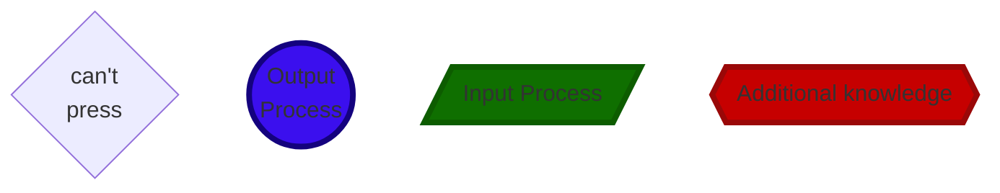
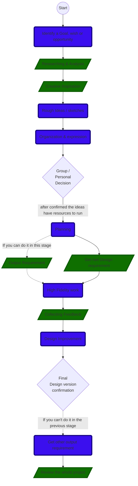
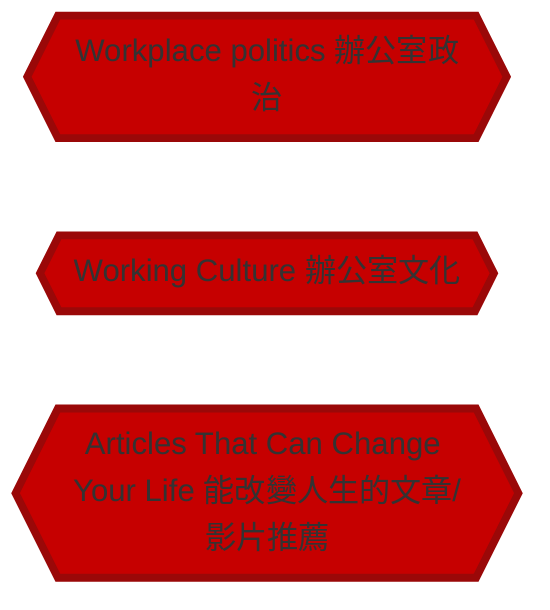

# Catalog

```mermaid
flowchart TD
O{can't <br> press}
P((Output <br> Process))
style P fill:#3B0FEE,stroke:#14027E,stroke-width:4px
Q[/Input Process/]
style Q fill:#0F6F00,stroke:#0D5C00,stroke-width:4px
U{{Additional knowledge}}
style U fill:#C60000,stroke:#9A0808,stroke-width:4px
```
## Design Process

```mermaid
flowchart TD
id1((Start)) --> A(Identify a Goal. wish or opportunity)
style A fill:#3B0FEE,stroke:#14027E,stroke-width:4px
A(Identify a Goal. wish or opportunity) --> B[/Researching & Analysis/]
style B fill:#0F6F00,stroke:#0D5C00,stroke-width:4px
B --> C[/Creative Inspiration/]
style C fill:#0F6F00,stroke:#0D5C00,stroke-width:4px
C --> D(Rough Ideas / sketches)
style D fill:#3B0FEE,stroke:#14027E,stroke-width:4px
D --> E(Organization & expression)
style E fill:#3B0FEE,stroke:#14027E,stroke-width:4px
E --> F{Group / <br> Personal <br> Decision}
F --> |after confirmed the ideas have resources to run| G(Planning)
style G fill:#3B0FEE,stroke:#14027E,stroke-width:4px
G --> H[/Get /set Design requirement/]
style H fill:#0F6F00,stroke:#0D5C00,stroke-width:4px
G -.If you can do it in this stage.-> I[/Output Requirement/]
style I fill:#0F6F00,stroke:#0D5C00,stroke-width:4px
I -.-> J(High Fidelity work)
style J fill:#3B0FEE,stroke:#14027E,stroke-width:4px
H --> J(High Fidelity work)
J --> K[/Collecting Feedbeck/]
style K fill:#0F6F00,stroke:#0D5C00,stroke-width:4px
K --> L(Design Improvement)
style L fill:#3B0FEE,stroke:#14027E,stroke-width:4px
L --> M{Final <br> Design version <br> confirmation}
M -.If you can't do it in the previous stage.-> N(Get other output requirement)
style N fill:#3B0FEE,stroke:#14027E,stroke-width:4px
N --> O[/Review the whold project/]
style O fill:#0F6F00,stroke:#0D5C00,stroke-width:4px
```

## Additional knowledge

```mermaid
flowchart LR
R{{Workplace politics 辦公室政治}}
style R fill:#C60000,stroke:#9A0808,stroke-width:4px
S{{Working Culture 辦公室文化}}
style S fill:#C60000,stroke:#9A0808,stroke-width:4px
T{{Articles That Can Change Your Life 能改變人生的文章/影片推薦}}
style T fill:#C60000,stroke:#9A0808,stroke-width:4px
```
